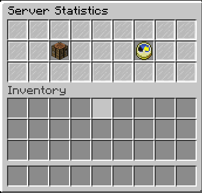

# Plugin management

## Installing plugins on your sub-server


In order to install plugins, you'll need to be on your server. If you're not sure on how to connect to it, the [Basic Instructions](basic-instructions.md) page might help you.


After successfully connecting to your subserver, you need to execute the command below:

```
/menu
```

A Inventory GUI should appear. If it does not, please contact the server administrator for help. The GUI should look like this:



After entering the GUI, select the clock icon with text Plugin Management. By clicking this button, you'll see all available plugins that owners pre-configured for you to be able to install. All the plugins marked with red-stone blocks are disabled and ready for you to install them. All the plugins that are marked with emerald blocks are currently installed and can be removed with a simple click.


**WARNING**: Please make sure to reboot your server after installing new plugins by typing in the command `/stop.`After that, you can boot your server back up by executing command `/playerserver start`. For more informations, visit the [Basic Instructions](basic-instructions.md) page.

